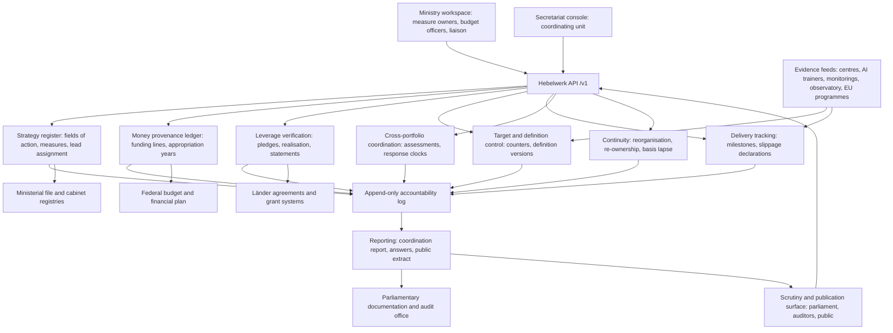

# Hebelwerk

**Source:** `ai-in-gov/Nationale_KI-Strategie_engl/`
**Domain:** `ai-gov`
**One-liner:** Hebelwerk gives the ministries that jointly own a national AI strategy a single delivery ledger in which every measure has a named lead ministry, a typed commitment strength, a money-provenance record, and a verified co-financing balance — so the strategy's leverage claim can be proven to parliament instead of asserted.
**Wedge:** The strategy secretariat shared by the three co-authoring ministries, starting with the measures that carry countable targets — the network of at least twelve centres of excellence and application hubs, the 100 additional AI professorships, the 1,000 companies a year to be contacted by AI trainers, and the 50 environmental flagship applications.
**Positioning:** A delivery and accountability ledger for multi-ministry technology strategies. It exists because the federal AI strategy commits around €3 billion up to and including 2025 across three ministerial portfolios and twelve fields of action, then states that business, science and the Länder will at least double that amount — a leverage promise made before a single co-financing agreement has been signed, in a document where "we will fund", "we will negotiate with the Länder", "we are exploring the possibility" and "we advocate" all appear in the same bulleted voice.

## Market research synthesis

### Thesis from source

The strategy is explicit that it is not a single-ministry document. It was drawn up by the Federal Ministry of Education and Research, the Federal Ministry for Economic Affairs and Energy, and the Federal Ministry of Labour and Social Affairs, based on suggestions taken from a nationwide online consultation. It sets three goals of deliberately equal ranking — making Germany and Europe a leading centre for AI, ensuring responsible development and use for the good of society, and embedding AI in society in ethical, legal, cultural and institutional terms — and then distributes the work across twelve fields of action, from strengthening research (3.1) through the world of work (3.5), tasks reserved for the state (3.7), data availability (3.8), the regulatory framework (3.9), standards (3.10), networking (3.11) and societal dialogue (3.12). Nothing in that structure tells a reader which ministry owes which measure by when.

The money is stated with unusual precision and unusual conditionality in the same breath. The 2019 federal budget allocates a total of €500 million to reinforce the strategy for 2019 and the following years. Combining that with "a certain fraction" of the increase in research and development funding earmarked to reach the target of spending 3.5% of gross national product on R&D, the Federation expects to make available approximately €3,000 million for implementation in the period from 2018 to 2025. Then comes the load-bearing sentence: "The leverage effect this will have on business, science and the Länder will result in the overall amount available being at least doubled." Two further qualifications sit next to it. Some measures are already being implemented and their financial implications "have been factored into the current financial plan" — that is, they are not new money. And the scope of vertical, sector-specific support "will be defined by the political and budgetary provisions of the Coalition Agreement" — that is, it is contingent on a political document that outlives no election. At least one named measure is funded by internal reallocation rather than new appropriation: the Business Start-ups in Science programme (EXIST) is to be reinforced from 2020 "by shifting resources within the relevant individual budget", having already doubled its 2019 budget relative to previous years.

The delivery mechanics are heterogeneous in a way that defeats a normal programme plan. Some commitments are direct federal spend. Others require agreement with actors the Federation cannot direct: the long-term funding commitment for the centres of excellence is to be reached with the Länder; the future of the German Research Center for Artificial Intelligence — the world's largest AI research institute, source of more than 70 spin-off companies — depends on negotiations with its shareholders; the AI professorship programme is to be explored "with the Länder"; education and training action "must primarily come from the Länder and the social partners"; standardisation is acknowledged to be "primarily up to the private sector, not the state", with the Federation merely advocating that DIN and DKE act and exploring funding so SME experts can attend international standardisation meetings. Elsewhere the verb is weaker still: the Federation "is looking at the possibility" of binding standards in healthcare, and "advocates" a European standardisation roadmap. A ledger that records all of these as "commitments" without distinguishing them is a ledger that will mislead its own authors.

Finally, the strategy creates its own scrutiny. It states that the responsible ministries are to regularly assess the impact of AI progress on other policy areas and what this implies for their own activities, and that systematic analysis, observation and regular dialogue between the responsible ministries is required to detect undesirable developments early. It commits to coordination with a long list of parallel vehicles — the High-Tech Strategy 2025, one of whose twelve missions is "Rolling out AI", the digitalisation implementation strategy, the German Sustainability Strategy and the Agenda 2030 sustainable development goals, the Data Ethics Commission within the Digital Council, Plattform Lernende Systeme, Plattform Industrie 4.0, the national platform on the future of mobility, the federal IT consolidation project, the Federal Office for Information Security, the Central Office for Information Technology in the Security Sector, and the Geoinformation Strategy. It commits to coordination with the Study Commission "Artificial Intelligence – Social Responsibility and Economic, Social and Ecological Potential" set up by the Bundestag on 27 September 2018. It commits to input into the European Commission's coordinated action plan and to assessing, on the basis of the principle of subsidiarity, at what level action should be taken, with implications for Horizon Europe, Digital Europe and the European Social Fund up to 2027. Every one of those is a body that will eventually ask what happened, and the strategy provides no instrument for answering.

### Buyer & economic model

- Primary buyer: the strategy secretariat jointly funded by the three co-authoring ministries — Education and Research, Economic Affairs and Energy, Labour and Social Affairs — with the head of the coordinating unit as sponsor and the three budget directorates as co-signatories. A second buyer appears within two years: the Land chancelleries that are asked to co-finance and want their contribution counted accurately.
- Users: the coordinating unit's measure controllers; the Referat leads inside each ministry who own individual measures; budget officers who must reconcile the ledger to individual budget plans and the mid-term financial plan; the parliamentary and audit liaison staff who draft answers for the Study Commission, written parliamentary questions and the federal audit office; Länder liaison officers; the secretariats of the platforms and observatories named in the strategy.
- Budget owner / value metric: the coordinating unit's operating budget, defensible as coordination cost against approximately €3 billion of federal money to 2025. The value metric is the share of the strategy's own claims that can be evidenced on demand — specifically the proportion of the doubling promise backed by confirmed, contracted co-financing rather than announcement.
- Competing status quo: a shared spreadsheet of measures maintained by whichever ministry chaired the last coordination meeting, refreshed by email round-robin before each parliamentary deadline; separate progress narratives written independently by three ministries that do not reconcile; target numbers quoted from the strategy text itself long after the underlying definition has quietly changed; and the annual ritual of re-announcing the same measure as new money in a fresh press release because nobody can prove it was already in the financial plan.

### Domain constraints

- Regulatory / trust / safety: budgetary law governs everything. Federal money is appropriated annually, so a 2018–2025 commitment is legally a sequence of annual authorisations plus commitment appropriations, and the ledger must never imply that later years are secured. Reallocation within an individual budget plan is not new money and must be recorded as such. The federal audit office can examine any of it for value for money, and the Bundestag's Study Commission and individual members can demand figures with short deadlines. Statements to parliament must be reconcilable to the published budget, which means the ledger's own arithmetic has to survive being checked line by line.
- Data sensitivity: most of the content is publishable, and much of it is subject to transparency duties — but not all of it at once. Negotiating positions with the Länder on a long-term funding commitment, the state of negotiations with the research institute's shareholders, unannounced reallocations, and draft slippage assessments are pre-decisional. Hebelwerk therefore has to hold a publication state per record, with a defensible reason for withholding, rather than a single public/private switch on the whole system.
- Change-management realities: three ministries with different cultures, different file-keeping traditions and no hierarchy between them; measures whose delivery depends on Länder, social partners, standardisation bodies, EU programmes and private shareholders; machinery-of-government changes that rename or split portfolios mid-strategy and orphan measures; and an election cycle that can retire the Coalition Agreement on which the vertical support depends. Any tool that requires the three ministries to agree on a single work-breakdown structure before it produces value will not be adopted. Hebelwerk must produce value from the first measure entered, and must tolerate a ledger that is honestly incomplete.

## Business requirements

- BR-1: Every measure in the strategy carries exactly one accountable lead ministry and one named responsible unit at all times; the register reports the count of measures with no current lead as a headline figure, and no measure may sit unowned for longer than the coordination cycle without appearing in the coordination report.
- BR-2: Each measure is classified by commitment strength — firm, conditional, or advocacy — and by the instrument that actually delivers it, so that federal spend, agreements to be reached with the Länder, negotiations with third-party shareholders, private standardisation work, social-partner dialogue and EU programme funding are never aggregated into a single count of "commitments".
- BR-3: Every euro attributed to the strategy is tagged with its provenance — newly appropriated, already in the mid-term financial plan before the strategy, reallocated within an individual budget plan, or notionally attributed from the wider research and development uplift — and the ledger refuses to report a total that mixes provenance classes without showing the split.
- BR-4: The doubling promise is reported as a leverage ratio computed only from co-financing that has been confirmed and contracted; pledged-but-unconfirmed contributions are visible as a separate figure, and the report states both numbers side by side whenever the leverage claim is quoted.
- BR-5: Every countable target has a written counting definition under version control; changing the definition of what counts as a centre, a new professorship, a company contacted or a flagship application creates a dated amendment record with a stated reason, and progress series show the definition version in force at each point.
- BR-6: Each lead ministry files a cross-portfolio spillover assessment for its measures on a fixed cycle, naming the policy areas affected and whether the effect is beneficial or adverse; each named ministry must acknowledge, accept or dispute within a set period, and unanswered assessments are reported as coordination failures with an age.
- BR-7: Every measure records a subsidiarity determination — federal, Länder, or European level — and where the determination is European, the linked programme is named so that the same activity is never counted both as a federal measure and as an EU-funded one.
- BR-8: When portfolios are reorganised, renamed or merged, all affected measures are re-owned within a defined transition window; the ledger preserves the original assignment, records the reorganisation as an event, and reports how many measures changed hands and how many were left orphaned.
- BR-9: Slippage is recorded as a first-class act, not an absence: where a milestone is missed, the lead unit must state the cause — appropriation timing, failure to reach agreement with a third party, capacity, dependency on another measure, or deliberate deprioritisation — and whether the target, the date, or the scope is being revised.
- BR-10: Every external scrutiny request — a Study Commission question, a written parliamentary question, an audit enquiry, a transparency request — is answered from the ledger, with the answer, the records it relied on, and the date recorded; the report shows the median time to answer and any answer that could not be evidenced from the ledger.
- BR-11: Each record carries a publication state and, where withheld, a stated reason; the system produces a public delivery extract on the cycle the ministries commit to, and internal-only content never leaks into the extract by default.
- BR-12: Measures whose legal or political basis has lapsed — a coalition provision that no longer exists, an expired framework agreement, a programme that ended — are marked as basis-lapsed rather than silently carried forward, and the coordination report lists them with the money still attributed to them.

## User stories

Canonical user stories live in sibling [USER_STORIES.md](USER_STORIES.md).

## System design

### Overview

Hebelwerk is the ledger of record for a strategy that three ministries own jointly and no one ministry can deliver. It starts from the strategy text: fields of action are registered, and under them measures, each with an accountable lead ministry, a responsible unit, a commitment strength, a delivery instrument and a subsidiarity determination. Money is attached to measures as funding lines, and every line carries a provenance class and a per-year authorisation state, so the system can always separate what has been newly appropriated from what was already in the financial plan, what has been shifted within an individual budget plan, and what is a notional share of a wider research and development uplift.

The leverage promise is treated as an obligation rather than a slogan. Co-financing pledges from Länder, research organisations and industry are recorded against measures, then progressed through contracting and realisation as separate, evidenced steps. A leverage statement — the figure used whenever the strategy's doubling claim is repeated — can only be issued against confirmed contributions, and always carries the unconfirmed pledge total alongside it. Countable targets sit behind versioned counting definitions, so a change in what counts as a new centre or a company contacted produces a dated amendment with a reason instead of an unexplained jump in a series.

Coordination is enforced by scheduled duties with clocks. Each lead ministry files spillover assessments naming affected portfolios; the named ministries must acknowledge, accept or dispute within a period; silence ages and appears in the coordination report. Slippage must be declared with a cause and an explicit statement of whether date, target or scope is moving. When portfolios are reorganised, a reorganisation event re-owns measures within a transition window and preserves the prior assignment. On the outward face, scrutiny requests from the Bundestag Study Commission, written parliamentary questions, the federal audit office and transparency requests are answered from the ledger with their supporting records attached, and a public delivery extract is generated on the committed cycle from records whose publication state permits it.

### Actors & boundaries

- Actors: secretariat coordinators in the coordinating unit; measure owners in the three lead ministries and in line ministries that own individual measures; budget officers in each ministry's budget directorate; Länder and co-financing liaison officers; parliamentary and audit liaison staff; platform and observatory secretariats that supply delivery evidence; and external readers of the public extract.
- Trust boundary: Hebelwerk holds the accountability record — who owes what, out of which money, with whose co-financing, and what was said about it to parliament. It does not hold the ministries' file systems, does not execute budget transactions, and does not replace the budget as the authority for what is appropriated; every funding line is a reconciled reference to a budget position, and a discrepancy between the two is an exception the budget officer must clear, not something the ledger silently absorbs.
- Human-in-the-loop points: assigning a lead ministry and unit; classifying commitment strength and instrument type; tagging funding-line provenance and per-year authorisation; confirming that a co-financing pledge is contracted; amending a counting definition; accepting or disputing a spillover assessment; declaring slippage and its cause; approving a leverage statement; authorising a publication state; and signing off an answer to a scrutiny request.

### Core capabilities

1. **Strategy register** — fields of action, measures, lead ministry and responsible unit, commitment strength, delivery instrument, subsidiarity determination, and links to the parallel strategies and platforms the measure must be coordinated with.
2. **Money provenance ledger** — funding lines with provenance class, per-year authorisation state, reconciliation reference to the budget position, and refusal to aggregate across provenance classes without disclosure.
3. **Leverage verification** — co-financing pledges from Länder, science and industry; contracting and realisation evidence; leverage statements computed only on confirmed contributions with the unconfirmed total shown alongside.
4. **Target and definition control** — countable targets, versioned counting definitions, dated amendments with reasons, and progress series stamped with the definition version in force.
5. **Delivery tracking and slippage** — milestones typed by instrument, declared slippage with cause, and explicit revision of date, target or scope.
6. **Cross-portfolio coordination** — spillover assessments filed by lead ministries, acknowledgement duties on named ministries, ageing of unanswered assessments, and a coordination-failure figure in the report.
7. **Continuity management** — portfolio reorganisation events, re-ownership within a transition window, preservation of prior assignments, and basis-lapsed marking for measures whose political or legal foundation has expired.
8. **Scrutiny and publication** — scrutiny requests and answers with supporting records, per-record publication states with withholding reasons, and the periodic public delivery extract.

### Conceptual data

- Primary entities: `StrategyEdition`, `FieldOfAction`, `Measure`, `LeadAssignment`, `Ministry`, `DeliveryInstrument`, `SubsidiarityDetermination`, `FundingLine`, `AppropriationYear`, `TargetCounter`, `CountingDefinition`, `ProgressObservation`, `CoFinancingPledge`, `PledgeRealisation`, `LeverageStatement`, `DeliveryMilestone`, `SlippageDeclaration`, `SpilloverAssessment`, `CoordinationResponse`, `PortfolioReorganisation`, `ScrutinyRequest`, `AnswerRecord`, `PublicationRelease`, `CoordinationReport`.
- Critical events: measure registered; lead assigned or reassigned; commitment strength classified or reclassified; funding line tagged with provenance; appropriation year moved from planned to authorised; counting definition amended; progress observed under a definition version; pledge recorded, contracted, realised or lapsed; leverage statement issued or refused; milestone met or slipped with a cause; spillover assessment filed, acknowledged, accepted or disputed; assessment left unanswered past its period; portfolio reorganised and measures re-owned; measure marked basis-lapsed; scrutiny request received and answered; publication release issued.
- Retention / audit needs: the ledger is the primary evidence for statements made to parliament and to the federal audit office about a strategy running from 2018 to 2025, so records are retained for the life of the strategy plus the audit and archival period that applies to federal files, and are append-only. Counting definitions, leverage statements, provenance tags and answers to scrutiny requests are never overwritten: an amendment creates a new version with its predecessor intact, because the question the auditors will ask is not what the number is now but what the number was when it was quoted.

### Integrations (conceptual)

- Systems of record: the federal budget and mid-term financial plan as the authority for appropriations and individual budget plans; ministerial file and cabinet-document registries; the framework agreements and administrative agreements that carry Länder co-financing; grant and funding-programme management systems that hold the underlying awards; the parliamentary documentation system for questions and Study Commission proceedings.
- Upstream signals: progress evidence from the centres of excellence and their international advisory council; counts from the AI trainers at the Mittelstand competence centres; enrolment and appointment data behind the professorship programme; the AI monitoring of penetration rates and the skills monitoring used for the skilled labour strategy; the AI observatory's findings on uptake and impact in the world of work; deliverables from Plattform Lernende Systeme working groups and the standardisation roadmap work with the national standardisation institute; European programme reporting from Horizon Europe, Digital Europe and the European Social Fund; Franco-German network activity.
- Downstream actions: the coordination report and its coordination-failure figures; leverage statements released for use in ministerial communication; answers to the Study Commission, written questions and audit enquiries; the public delivery extract; re-ownership tasks issued after a portfolio reorganisation; and escalation lists of orphaned, slipped and basis-lapsed measures for the next inter-ministerial meeting.

### High-level architecture

Measure owners, budget officers and liaison staff work in a ministry workspace; the coordinating unit works in a secretariat console; parliament, auditors and the public reach the system through a scrutiny and publication surface. All three go through one API. Behind it, the register holds measures and their ownership, the money service holds provenance-tagged funding lines reconciled to budget positions, the leverage service holds pledges and issues statements only on confirmed contributions, the measurement service holds versioned counting definitions and the progress series bound to them, the coordination service runs spillover duties and their clocks, and the continuity service handles reorganisation and lapse. An append-only accountability log records every act, and the reporting service composes the coordination report, the scrutiny answers and the public extract from it.

### Success metrics

- Leading: share of measures with a current named lead ministry and unit; share classified by commitment strength and delivery instrument; share of attributed money carrying a provenance tag; number of countable targets with a versioned counting definition in force; median days from spillover assessment filed to acknowledgement; count of unanswered assessments older than the response period; count of orphaned measures and days orphaned; share of funding lines reconciled to a budget position without an open discrepancy.
- Lagging: confirmed leverage ratio against the doubling promise, reported next to the unconfirmed pledge total; share of the approximately €3 billion attributed to 2025 that is newly appropriated rather than pre-existing, reallocated or notionally attributed; progress against the countable targets — centres and application hubs in the network, additional professorships created, companies contacted per year by AI trainers, environmental flagship applications initiated — each stated under the definition version in force; count of definition amendments and the direction of their effect on reported progress; median days to answer a scrutiny request and number of answers that could not be evidenced from the ledger; number of measures re-owned after a reorganisation and number left orphaned past the transition window; number of measures marked basis-lapsed and the money still attributed to them.

## OpenAPI skeleton

Canonical HTTP surface lives in sibling `openapi.yaml`. Summarize here:

- **Base path:** `/v1/...`
- **Auth:** `X-API-Key` for ministry systems, evidence feeds and the public extract client; Bearer JWT for named officials whose acts are attributed in the accountability log.
- **Resource groups:** `Register`, `Ownership`, `Money`, `Leverage`, `Targets`, `Delivery`, `Coordination`, `Continuity`, `Scrutiny`, `Reporting`.
