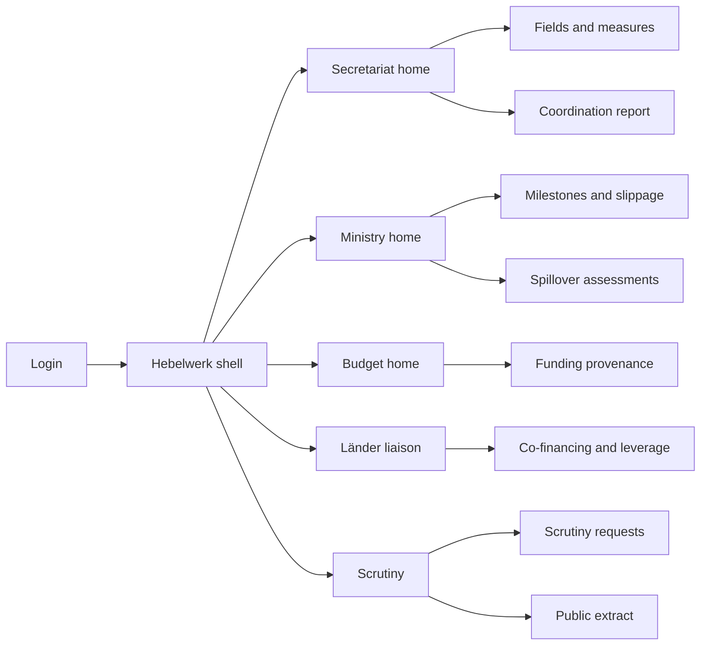
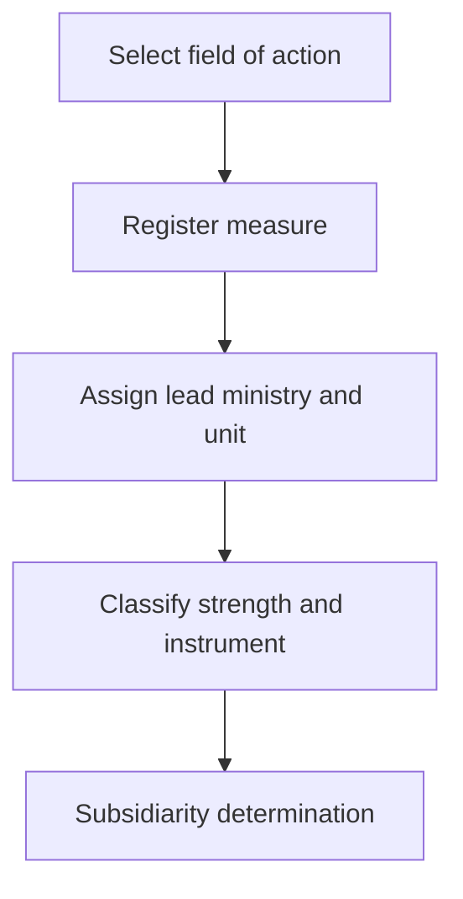
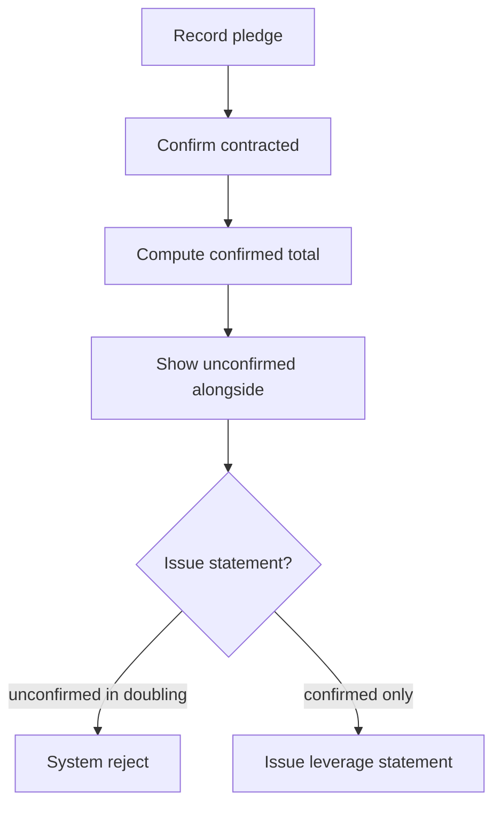

# Hebelwerk — Web app

**Product:** [PRODUCT.md](./PRODUCT.md)
**Primary surface:** Multi-ministry strategy delivery ledger (secretariat + three co-authoring ministry workspaces under one Hebelwerk shell)
**Secondary surfaces:** Public delivery extract (publication-state filtered); parliamentary answer pack export (read-only with evidence links)
**Design thesis:** Hebelwerk is a federal delivery ledger that refuses to let “we will fund,” “we will negotiate,” and “we advocate” collapse into one commitment count. The metaphor is a Haushaltsplan meeting a leverage balance sheet: every measure has a lead ministry, every euro has provenance, and the doubling promise only prints when co-financing is contracted. Visual language is federal charcoal and signal-yellow (Bauhaus-adjacent, not cream-terracotta), with ledger-blue for authorised years and rust only for orphaned ownership or basis-lapse. The Hebelwerk wordmark sits as a quiet mint on every money and scrutiny screen — the joint instrument of three ministries, not a single portfolio’s dashboard.

## UX research synthesis

### Category peers (best-in-class)

- **UK Infrastructure and Projects Authority / GMPP reporting:** RAG delivery with explicit slippage narratives and accountable SRO. Steal: slippage as a declared act with cause; reject single RAG that hides commitment strength (firm vs advocacy).
- **EU Recovery and Resilience Scoreboard:** Milestone/target tracking with definitional clarity and public extracts. Steal: versioned targets and public vs internal publication states; reject treating all milestones as federally controllable spend.
- **German Bundeshaushalt / open budget explorers (e.g. OffenerHaushalt patterns):** Provenance of appropriation years and individual plans. Steal: refuse mixed totals without split; reject citizen-budget storytelling as the operator home.
- **USASpending.gov Award Data / DATA Act interfaces:** Traceable money lines with reconciliation to authority systems. Steal: funding-line references that must reconcile; reject US CFDA taxonomy where Hebelwerk needs Länder/EU subsidiarity.

### Patterns to adopt / reject

- **Adopt:** Unowned-measure headline; firm/conditional/advocacy classification; money provenance split mandatory on totals; leverage statements that reject unconfirmed pledges in the doubling figure; versioned counting definitions; spillover clocks; portfolio reorganisation events; scrutiny answers with attached ledger evidence; basis-lapsed marking.
- **Reject:** One “% complete” for the whole strategy; press-release money that mixes new and reallocated; silent target redefinition; spreadsheet round-robin as UX metaphor; purple AI strategy assistants; card walls of the twelve fields as the only home.

### Trust, density, and workflow constraints from PRODUCT.md

Budgetary law: later years of 2018–2025 are planned until authorised (BR-3). Leverage may only count contracted co-financing (BR-4). Pre-decisional Länder negotiations need per-record publication states (BR-11). Three ministries share ownership without hierarchy — value from first measure, tolerate incomplete ledger. Scrutiny deadlines are short; answers must be reproducible (BR-10).

## Information architecture

### Nav model

### Roles → default home

| Role | Default home | Why |
|------|--------------|-----|
| Secretariat coordinator | Secretariat home — unowned + coordination failures | Joint ownership clock (BR-1, BR-6) |
| Ministry measure owner (Referat) | My measures — milestones and definitions | Delivery with instrument type (BR-2, BR-5, BR-9) |
| Budget officer | Money provenance ledger | Split totals; authorised vs planned years (BR-3) |
| Länder / co-financing liaison | Leverage verification | Confirmed vs pledged (BR-4) |
| Parliamentary / audit liaison | Scrutiny requests | Evidence-linked answers (BR-10) |
| Continuity admin | Portfolio reorganisations | Re-own within window (BR-8, BR-12) |

### Cross-links to OpenAPI resources

| Nav area | OpenAPI tags / resources |
|----------|---------------------------|
| Fields / measures / classification | Register |
| Lead assignment / re-ownership | Ownership |
| Funding lines / appropriation years / attribution summary | Money |
| Co-financing / leverage statements | Leverage |
| Targets / counting definitions / progress | Targets |
| Milestones / slippage | Delivery |
| Spillover assessments / responses | Coordination |
| Portfolio reorganisations / basis-lapse | Continuity |
| Scrutiny requests / answers / publication releases | Scrutiny |
| Coordination report | Reporting |

## Screen inventory

### Secretariat home

- **Purpose:** Answer “what is unowned, unanswered, or basis-lapsed before the next inter-ministerial meeting?”
- **Entry:** Coordinator default login.
- **Layout regions:** Brand + ministry filter; headline counts (unowned, firm/conditional/advocacy split, coordination-failure age); contingent-by-construction list (Länder/shareholders/standards); at-risk leverage strip.
- **Primary actions:** Assign lead; open coordination report; escalate orphans.
- **Empty / loading / error:** Empty = import twelve fields of action from strategy edition.
- **BR / story ties:** BR-1, BR-2, BR-6, BR-12.

### Measure register and editor

- **Purpose:** Register measures under fields with lead, commitment strength, instrument, subsidiarity.
- **Entry:** Register nav; create from home.
- **Layout regions:** Field tree; measure table; editor panes for classification, instrument, EU programme link, parallel-strategy links.
- **Primary actions:** Save; assign lead; classify; mark subsidiarity.
- **Empty / loading / error:** Validation blocks save without lead after grace cycle warning.
- **BR / story ties:** BR-1, BR-2, BR-7.

### Money provenance ledger

- **Purpose:** Tag every euro; refuse mixed totals without split; show authorised vs planned per year.
- **Entry:** Budget home.
- **Layout regions:** Funding-line table (provenance class, budget reference, year states); attribution summary that always shows split; reconciliation exception queue.
- **Primary actions:** Add line; set year authorised; clear reconciliation exception; export provenance pack.
- **Empty / loading / error:** Attempted mixed total without split = hard block with disclosed split UI.
- **BR / story ties:** BR-3; budget officer stories.

### Leverage verification

- **Purpose:** Pledges → contracted → realised; leverage statement only on confirmed; unconfirmed shown alongside.
- **Entry:** Liaison home; secretariat leverage strip.
- **Layout regions:** Pledge pipeline; evidence attachments; leverage statement composer (rejects unconfirmed in doubling figure); side-by-side confirmed/unconfirmed.
- **Primary actions:** Record pledge; confirm contracted; issue leverage statement; reject invalid statement.
- **Empty / loading / error:** Empty = no pledges; invalid issue attempt shows accepted figure.
- **BR / story ties:** BR-4.

### Target and counting definitions

- **Purpose:** Versioned definitions for centres, professorships, companies contacted, flagships; progress stamped with version.
- **Entry:** From measure; Targets nav.
- **Layout regions:** Definition version timeline; amendment reason; progress series with version pin; comparison warning on definition change.
- **Primary actions:** Amend definition; record progress observation; export series.
- **Empty / loading / error:** Progress blocked until definition v1 exists.
- **BR / story ties:** BR-5; centres/professorships/trainers/flagships wedge.

### Delivery milestones and slippage

- **Purpose:** Instrument-typed milestones; slippage as first-class act with cause and date/target/scope revision.
- **Entry:** Ministry home.
- **Layout regions:** Milestone list; slippage form (cause taxonomy); revision declaration; third-party dependency flag.
- **Primary actions:** Complete milestone; declare slippage; revise date/target/scope.
- **Empty / loading / error:** Missed without slippage = amber nag, then coordination report flag.
- **BR / story ties:** BR-9.

### Spillover assessments

- **Purpose:** Cross-portfolio impact filed on cycle; acknowledge/accept/dispute with ageing silence.
- **Entry:** Coordination nav; named ministry inbox.
- **Layout regions:** Assessment queue; affected portfolios; response clock; unanswered age in report preview.
- **Primary actions:** File assessment; respond; escalate aged silence.
- **Empty / loading / error:** Empty inbox = healthy for respondent role.
- **BR / story ties:** BR-6.

### Portfolio reorganisation and basis-lapse

- **Purpose:** Re-own measures in transition window; preserve history; mark basis-lapsed with money still shown.
- **Entry:** Continuity admin; secretariat alerts.
- **Layout regions:** Reorganisation event wizard; orphan countdown; basis-lapse list with attributed money.
- **Primary actions:** Start reorganisation; reassign; mark basis-lapsed; clear orphans.
- **Empty / loading / error:** Orphans past window = headline coral count.
- **BR / story ties:** BR-8, BR-12.

### Scrutiny request workspace

- **Purpose:** Answer Study Commission / WPQ / audit / transparency from ledger with attached records.
- **Entry:** Scrutiny home.
- **Layout regions:** Request queue; answer editor; evidence linker; median time-to-answer stats; “could not evidence” flag.
- **Primary actions:** Draft answer; attach records; sign off; export pack.
- **Empty / loading / error:** Empty = no open scrutiny; missing evidence blocks sign-off option labeled as such.
- **BR / story ties:** BR-10.

### Public delivery extract

- **Purpose:** Periodic public release from publication-permitted records only.
- **Entry:** Scrutiny/publication nav; secondary public surface.
- **Layout regions:** Publication state filters; withholding reason log (internal); extract preview; release history.
- **Primary actions:** Generate extract; publish release; audit leak check.
- **Empty / loading / error:** Internal-only content excluded by default with count of withheld.
- **BR / story ties:** BR-11.

### Coordination report

- **Purpose:** Single inter-ministerial pack: orphans, spillover failures, slippage, basis-lapse, leverage side-by-side.
- **Entry:** Secretariat; scheduled.
- **Layout regions:** Failure figures; measure tables; money provenance split; leverage pair; export.
- **Primary actions:** Generate; circulate; deep link to remediate.
- **Empty / loading / error:** Partial ledger allowed with honesty banner (“incomplete by design”).
- **BR / story ties:** BR-1, BR-4, BR-6, BR-12.

## Key flows

1. **Register owned measure** — field → measure → lead + unit → classify strength/instrument → subsidiarity; failure: unowned past cycle → coordination report.

2. **Issue leverage statement** — pledges → contract evidence → compute confirmed → show unconfirmed alongside → issue or reject.

3. **Declare slippage** — missed milestone → cause → revise date/target/scope → visible in report.

4. **Answer scrutiny** — receive request → pull ledger records → answer + attachments → record median latency.

5. **Portfolio reorganisation** — event → transition window → re-own → report orphans and handoffs.

## Design system

### Tokens (CSS variables)

- `--color-ink: #1B1B1B` — primary text
- `--color-ground: #E8EAED` — cool grey ground (not warm cream)
- `--color-panel: #FFFFFF` — panels
- `--color-charcoal: #2C2C2C` — nav
- `--color-signal: #E5A100` — attention / advocacy / conditional
- `--color-ledger: #1F4E79` — authorised money / firm commitment
- `--color-moss: #3D6B4F` — contracted co-financing confirmed
- `--color-rust: #A33B2B` — orphaned / basis-lapsed / refused statement
- `--color-steel: #5F6B76` — secondary labels
- `--color-brand: #C4A000` — Hebelwerk signal accent (restrained)
- `--font-display: "IBM Plex Sans", sans-serif` — titles and KPI numerals (Bauhaus clarity)
- `--font-mono: "IBM Plex Mono", monospace` — budget refs, definition versions, measure ids
- `--space-1`…`--space-8`: 4px scale
- `--radius-sm: 2px`; `--radius-md: 4px` — sharp federal ledger
- `--motion-stamp: 150ms ease-out` — provenance tag apply
- `--motion-reject: 200ms ease-in-out` — leverage reject shake
- `--motion-age: 300ms ease-out` — spillover age intensify
- Atmosphere: subtle horizontal Haushaltslinie rules; no glossy ministry photo heroes; public extract uses higher contrast print-safe palette.

### Typography & brand

- Plex Sans for all console chrome; mono for money and definition versions.
- Brand wordmark left on money, leverage, and scrutiny screens.
- Login: brand hero; headline (“Prove the leverage”); one CTA — no twelve-pillar icon grid.

### Do / don’t

- **Do:** Split provenance on every total; show firm/conditional/advocacy as three numbers; require slippage cause; attach evidence to scrutiny answers; preserve prior ownership on reorg.
- **Don’t:** Single % complete; mix new and reallocated money; silent definition edits; purple AI; emoji RAG; card galleries of fields as home.

### Accessibility & domain trust cues

- Signal yellow never sole indicator — pair with labels (conditional/advocacy).
- Live regions for orphan count and spillover overdue.
- Focus: register → money → leverage → scrutiny.
- Append-only history for definitions, leverage statements, and answers.

## Component patterns

- **CommitmentStrengthTriplet** — firm / conditional / advocacy counts.
- **ProvenanceSplitTotal** — refuses undisclosed mix.
- **AppropriationYearChip** — authorised vs planned.
- **LeverageStatementComposer** — confirmed + unconfirmed side-by-side; reject path.
- **CountingDefinitionVersion** — pinned on progress series.
- **SlippageDeclarationForm** — cause + revision type.
- **SpilloverAgeClock** — unanswered assessment ageing.
- **OrphanMeasureBanner** — unowned headline.
- **BasisLapseTag** — lapsed foundation with money still visible.
- **ScrutinyEvidenceLinker** — answer ↔ ledger records.
- **PublicationStateControl** — withhold reason required.

## Out of scope for v1 web

- Executing budget transactions or replacing Haushalt systems; Länder cabinet systems; full parliamentary document management; citizen consultation portal for strategy drafting; AI policy chatbot; EU programme grant administration (link only).
